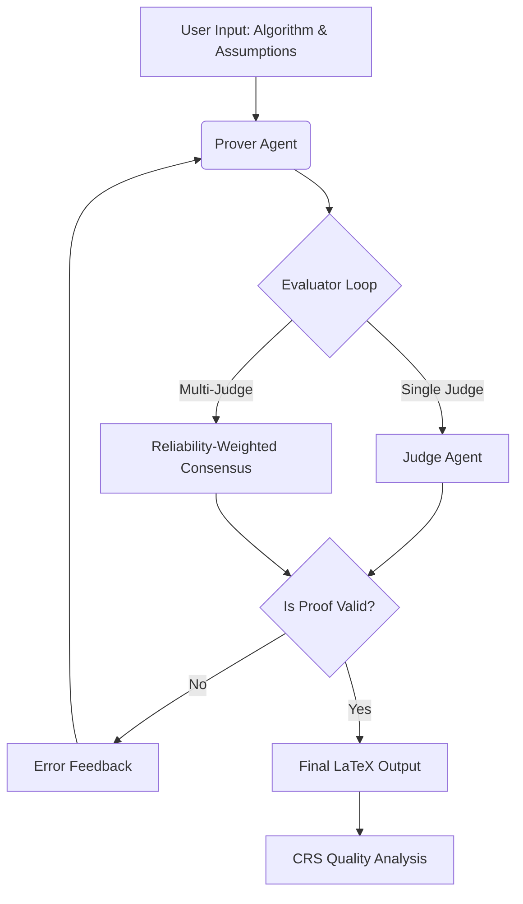

---

# Convergence Proof Agent (v3)

[](https://www.python.org/downloads/)
[](https://opensource.org/licenses/MIT)
[](https://github.com/langchain-ai/langgraph)

An advanced multi-agent LLM system designed for automated convergence proof generation, structured evaluation, and iterative refinement. This system introduces the **Correction Reasoning Score (CRS)** and **Judge Reliability Score (JRS)** to quantify mathematical reasoning improvements.

---

## 🧠 Overview

The **Convergence Proof Agent** automates the rigorous process of proving convergence for optimization algorithms. By moving beyond simple "one-shot" generation, the system uses a structured workflow to identify errors at the step level and iteratively correct them, mimicking the peer-review process in mathematical research.

### Key Capabilities
*   **LaTeX Generation:** Produces production-ready convergence proofs.
*   **Structured Auditing:** Evaluates proofs using a strict JSON schema for step-by-step verification.
*   **Multi-Judge Consensus:** Reduces LLM hallucination by aggregating verdicts from multiple parallel judges.
*   **Quality Metrics:** Quantifies the "intelligence" of a correction using the CRS metric.

---

## 🏗 Architecture

The system is built on **LangGraph**, facilitating a stateful, iterative loop between agents.



### Agents
1.  **Prover Agent:** Responsible for generating and revising LaTeX proofs. Uses phase-aware temperature settings (High for initial creation, Low for correction).
2.  **Evaluator (Single Judge):** A deterministic judge providing structured JSON feedback on logical consistency.
3.  **Multi-Judge Evaluator:** Orchestrates multiple LLMs to reach a consensus, filtering outliers through Jaccard similarity and reliability modeling.

---

## 📊 Core Metrics

### 1. Correction Reasoning Score (CRS)
CRS measures the effectiveness of an iterative fix by balancing error resolution against regression.

$$CRS = [w_{err} \cdot ERR + w_{tfp} \cdot TFP] \times (1 - w_{rp\_pen} \cdot RP)$$

*   **ERR (Error Resolution Rate):** Percentage of previous errors fixed.
*   **RP (Regression Penalty):** New errors introduced in the revision.
*   **TFP (Targeted Fix Precision):** Accuracy of the specific changes made.

### 2. Judge Reliability Score (JRS)
Used to weight opinions in the multi-judge setup.

$$JRS_i = \alpha \cdot ESA_i - \beta \cdot |z_i|$$

*   **ESA:** Error Set Agreement (Jaccard similarity with the majority).
*   **z:** Standardized deviation from the mean score.

---

## ⚙️ Installation

```bash
# Clone the repository
git clone https://github.com/your-username/llm4oml-agent.git
cd llm4oml-agent

# Set up virtual environment
python -m venv .venv
source .venv/bin/activate  # Windows: .venv\Scripts\activate

# Install dependencies
pip install -r requirements.txt
```

### 🔑 API Configuration
Create a `.env` file in the root directory:
```env
NVIDIA_API_KEY=your_key
OPENAI_API_KEY=your_key
OPENROUTER_API_KEY=your_key
ANTHROPIC_API_KEY=your_key
```

---

## ▶️ Usage

### Run a Single Proof
Generate a proof for a specific algorithm:
```bash
python scripts/run_single.py \
  --algorithm "SGD with decreasing learning rate" \
  --assumptions "Convex objective, bounded gradients" \
  --provider nvidia \
  --multi-judge
```

### Batch Processing
Run evaluations on a dataset of optimization problems:
```bash
python scripts/run_batch.py --input algorithms.csv --output batch_results --multi-judge
```

### Analyze Results
Generate plots and summary statistics from batch runs:
```bash
python scripts/analyze_results.py --results-dir batch_results
```

---

## 📂 Repository Structure

```text
llm4oml-agent/
├── config/             # YAML configuration for LLMs and Prompts
├── scripts/            # Entry points for single/batch runs
├── src/
│   ├── agents/         # Prover and Judge logic
│   ├── evaluators/     # Multi-judge consensus logic
│   ├── metrics/        # CRS and JRS implementations
│   ├── graph/          # LangGraph state machine definitions
│   └── models/         # Pydantic models for structured I/O
├── tests/              # Pytest suite for CRS and logic
└── requirements.txt
```

---

## 🔬 Research & Parameters

To ensure high-fidelity mathematical reasoning, the system employs **Phase-Aware Temperature Control**:

| Phase | Temperature | Goal |
| :--- | :--- | :--- |
| **Generation** | 0.7 | Encourage creative exploration of proof paths. |
| **Correction** | 0.4 | Focused refinement based on feedback. |
| **Evaluation** | 0.05 | Maximum determinism for auditing logic. |
| **Verification**| 0.05 | Final check for LaTeX syntax. |

---

## 📜 License
This project is licensed under the [MIT License](LICENSE).

## 👤 Author
**Varun Gambhir**
**Somshekar M**

